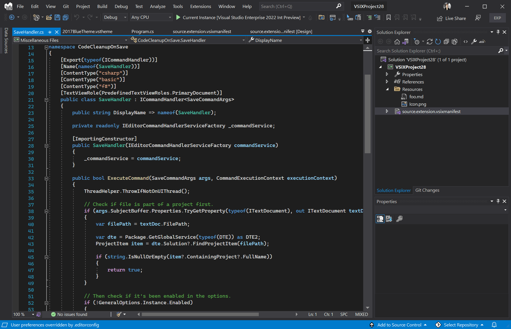
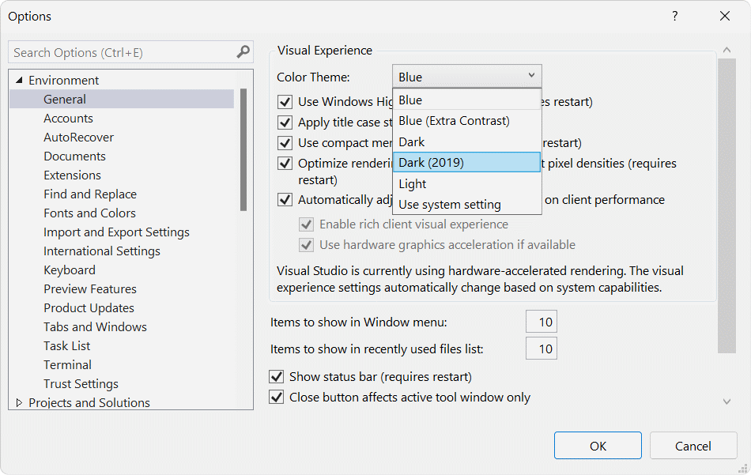

# Dark color theme (2019)

Download the extension at the
[Visual Studio Marketplace](https://marketplace.visualstudio.com/items?itemName=MadsKristensen.BlueColorTheme)
or try the
[CI build](http://vsixgallery.com/extension/DarkTheme2019.7fa839e2-b938-4b1c-9277-edaebe6fdeb5/).

---------------------------------------

The original dark theme from Visual Studio 2019 now available for Visual Studio 2022.

After installing the extension, the **Dark (2019)** theme becomes available in the dropdown under *Tools -> Options*.

## License
[Apache 2.0](LICENSE)